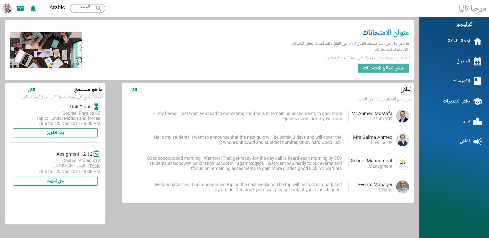
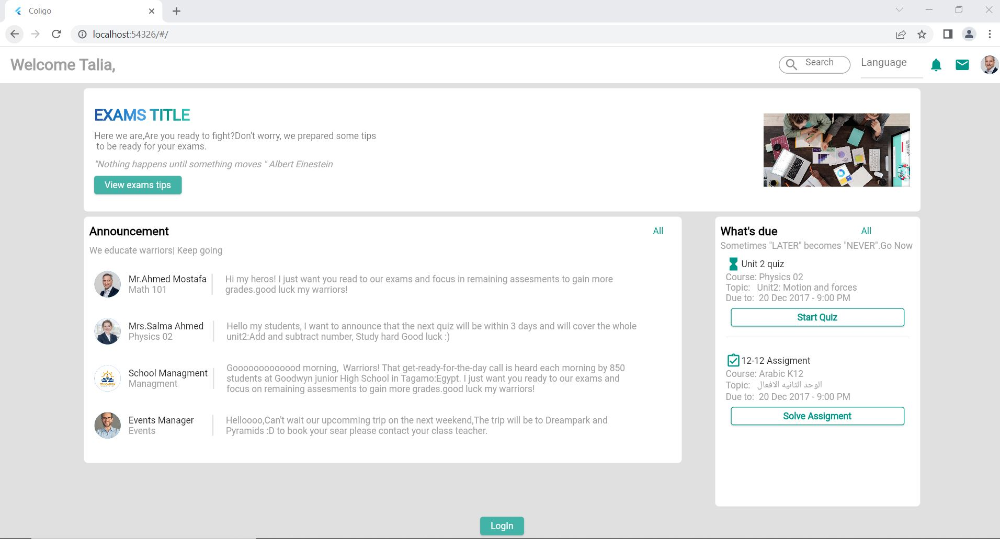
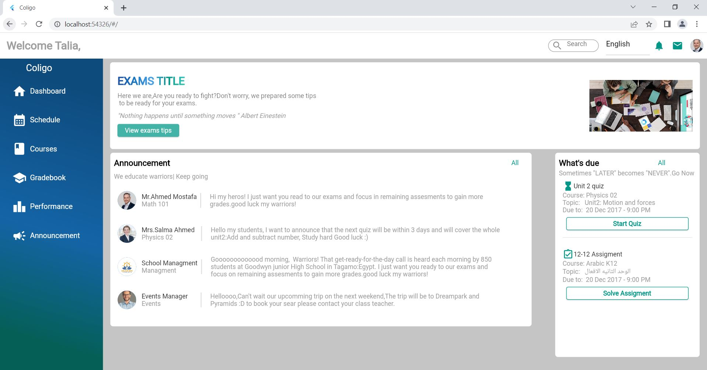
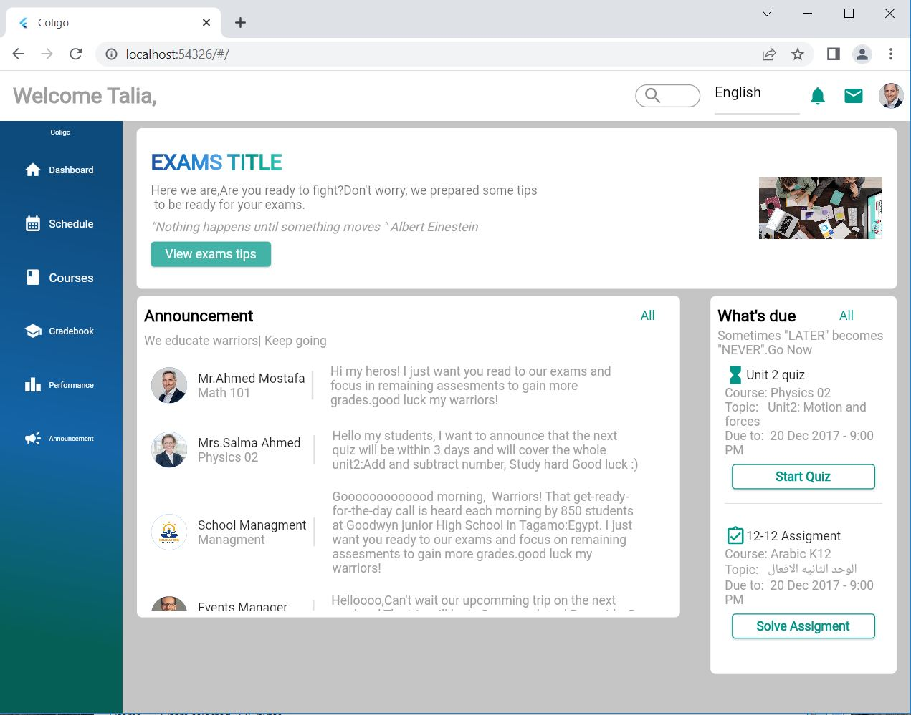

# Coligo
It is a place where students can find different feature for the college

## Table of contents
* [General info](#general-info)
* [Images](#images)
* [Technologies](#technologies)
* [How to use](#how-to-use)
* [Project Structure](#project-structure)

## General info
This is a web view application to aid students and the instructors to be in contact with each other. remind by quizes ,assigments and also announcements.It support english and arabic languages.

### Images
<table>
  <tr>
    <td>Coligo Arabic Language/td>
     <td>Coligo English Language before login</td>
  </tr>
  <tr>
   <td></td>
    <td>
  </tr>
  <tr>
    <td>Coligo English Language after loging in</td>
     <td>Coligo medium view</td>
  </tr>
  <tr>
  <td></td>
    <td></td>
  </tr>
 </table>


## Technologies
Project is created with:
* Flutter version: 3.3.2
* intl: 0.17.0
* provider: 6.0.4
* simple_gradient_text: 1.2.4

	
## How to use
#### Step1: you need to download or clone this repo
```
git clone https://github.com/SeifNagi/Coligo.git
```
#### Step2: you need to get all dependencies
```
flutter pub get
```
#### Step 3: run the localizaion command
```
flutter gen-l10n
```
#### Step 4: run the project
```
flutter run lib/main.dart
```
## Project Structure
```
colido/
├── lib/
│   ├── data/
│   │   ├── model/
│   │   │   └── language_mode
│   │   ├── quizes_data
│   │   └── announcements_data
│   ├── l10n
│   ├── presentation/
│   │   ├── page/
│   │   │   └── components
│   │   ├── style
│   │   └── widget
│   └── provider
└── asset
```
